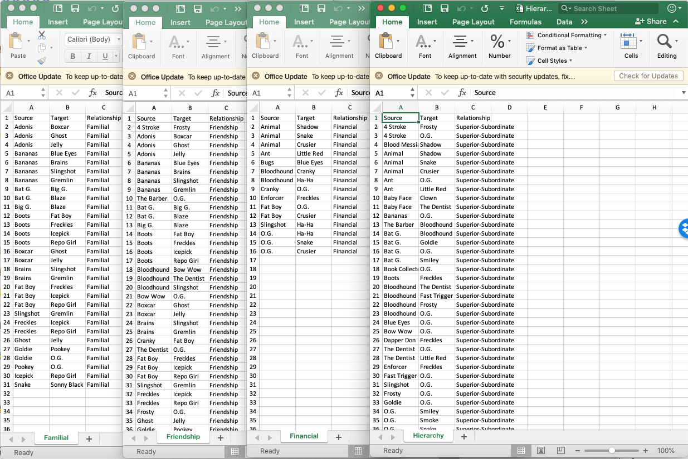
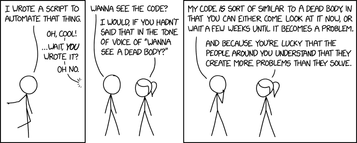

```{r setup, include=FALSE}
options(htmltools.dir.version = FALSE)
library(here)
library(tidyverse)
library(DT)
library(emo)
library(visNetwork)
library(igraph)
```

```{r xaringan-themer, include=FALSE}
library(xaringanthemer)
mono_light(
  # base_color = "white",
  code_font_family = "Fira Code",
  code_font_url    = "https://cdn.rawgit.com/tonsky/FiraCode/1.204/distr/fira_code.css",
  code_font_size = ".65em",
  text_font_google   = google_font("Work Sans", "300", "300i"),
  text_font_size = "25px",
  background_image = "corelogo.png",
  background_size = "20%", 
  background_posit = "bottom",
  padding = "1em 4em 1em 4em"
)
```


# Background

--
Social network analysis (SNA) is commonly used to understand groups and social formations. 
--
**The focus of this methodology is the relationships among individuals, which influence a person's behavior above and beyond the influence of his or her individual attributes (Valente 2010). **
--
As such, SNA enables analysts to understand how social ties help to define, enable, and constrain the knowledge, reach, and capacities of actors within groups (Cunningham, Everton, and Murphy 2016).

--

While social network research is **not** exclusively dependent on software applications, these do increase the efficiency of researchers. Here we will focus on **R**.


---

# Goals

Here we will explore some of the key SNA features of the open-source programming language **R**, and a variety of packages - primarily **igraph** (https://igraph.org/r/) and **visNetwork** (https://datastorm-open.github.io/visNetwork/) - developed to work with relational data. Specifically, we will:

--
* Explore, structure, visualize, and analyze relational data with the **igraph** library.

--
* Build processes in **R** with **igraph** to streamline analysis.

--
* Create interactive visualizations with the **visNetwork** package.

--
* Please note that **statnet** (http://www.statnet.org/) is another commonly used package among social network analysts.

---

# Supplemental Packages

* **here** - A package to make it easier to find your files by constructing paths to your project's files.
* **tidyverse** - A collection of packages designed for data science. Users get packages such as dplyr, ggplot, purr, etc.  
* **purr** - A useful tool for working with vectors. 
* **DT** - A "wrapper" of the JavaScript Library "DataTables". We will use it to build interactive data tables. 
* **kableExtra** - A package to help us build tables using HTML. 
* **emo** - A package that allows users to insert emoji into RMarkdown documents (like this one!). 
* **xaringan** - You're looking at it!

---

# Getting Started: Loading Data

Let's bring in data from an edgelist:

```{r, echo=TRUE, eval=FALSE}
read.csv(here::here("data/Familial.csv"), header = TRUE)
#familial <- as.data.frame(read.csv(file="Familial.csv", header=TRUE))
```

<br>

```{r, echo=FALSE, eval=TRUE}
read.csv(here::here("data/Familial.csv"), header = TRUE) %>%
  as.data.frame() %>%
  DT::datatable(
    class = 'cell-border stripe',
          rownames = FALSE,
          fillContainer = TRUE,
          options = list(
            pageLenght = 7,
            autoWidth = FALSE,
            dom = 'tp'
          )
          )
```


---

# Relationships Codebook

  * **Familial**: (person-to-person; i.e., one-mode) - Defined as any family connection through blood, adoption, or marriage.
  * **Financial**: person-to-person) - Defined as two actors, in reporting or intelligence, who are explicitly stated as transferring funds between one another for any purpose, legal or illegal. 
  * **Friendship**: (person-to-person) - Defined as two individuals who are explicitly stated as friends, or who are explicitly known as trusted confidants in reports or in intelligence documentation. 
  * **Hierarchy**: (person-to-person) - Defined as relationships between immediate superiors and subordinates in an organization. 
  
  
---

# Relationships Import

Familial:
```{r, echo=TRUE, eval=TRUE}
familial <- read.csv(here::here("data/Familial.csv"), header = TRUE)
```

Financial:
```{r}
financial <- read.csv(here::here("data/Financial.csv"), header = TRUE)
```

Friendship:
```{r}
friendship <- read.csv(here::here("data/Friendship.csv"), header = TRUE)
```

Hierarchy:
```{r}
hierarchy <- read.csv(here::here("data/Hierarchy.csv"), header = TRUE)
```


---

# Building Networks

First, install the package:
```{r, eval=FALSE}
install.packages("igraph")
```

Now load the package:
```{r, echo=TRUE, eval=TRUE, message=FALSE, tidy=TRUE}
library(igraph)
```

Create an **igraph** graph:
```{r}
familialNet <- igraph::graph_from_data_frame(familial,
                                     directed = FALSE) 
```


---

# Familial Network Object

```{r, echo=TRUE, eval=TRUE}
familialNet
```

--
  * `name` listed as `(v/c)`, which denotes a vertex-level character attributes

--
  * `Relationship` listed as `(e/c)` or edge-level character attributes


---

# Familial Network Edges

```{r, echo=TRUE, eval=TRUE}
E(familialNet)
```

```{r, echo=TRUE, eval=TRUE}
ecount(familialNet)
```


---

# Familial Network Nodes

```{r, echo=TRUE, eval=TRUE}
V(familialNet)
```

```{r, echo=TRUE, eval=TRUE}
vcount(familialNet)
```

```{r, echo=TRUE, eval=TRUE}
V(familialNet)$name
```


---

# Familial Network Visualization

```{r, echo=TRUE, eval=FALSE}
plot.igraph(familialNet)
```
.center[
```{r, echo=FALSE, eval=TRUE, fig.height=5.5}
plot.igraph(familialNet)
```
]


---

# Familial Network Visualization

.pull-left[
```{r, echo=TRUE, eval=FALSE}
plot.igraph(familialNet,
            # Nodes ====
            vertex.label = NA,
            vertex.color = "blue",
            vertex.size = 5,
            # Edge ====
            edge.color = "black",
            edge.arrow.size = 0,
            edge.curved = TRUE,
            # Other ====
            margin = .01,
            frame = FALSE,
            main = "Familial Network"
            )
```

.center[
Arguments = `r emo::ji("smile")`
]
]

.pull-right[
```{r, echo=FALSE, eval=TRUE, fig.height=12, fig.width=10}
plot.igraph(familialNet,
            vertex.label=NA,
            vertex.color="blue",
            vertex.size=5,
            edge.color="black",
            edge.arrow.size=0,
            edge.curved=TRUE, 
            margin = .01,
            frame = FALSE,
            main = "Familial Network"
            )
```
]


---

#So What?

--
.center[
Automation! Automation! Automation! 
]

--
.pull-left[
```{r, echo=TRUE, eval=FALSE}
read.csv(here::here("data/Financial.csv"), header = TRUE) %>%
  igraph::graph_from_data_frame(directed = FALSE) %>%
  igraph::plot.igraph(vertex.label=NA,
            vertex.color="blue",
            vertex.size=5,
            edge.color="black",
            edge.arrow.size=0,
            edge.curved=TRUE, 
            margin = .01,
            frame = FALSE
            )
```

.center[
`r emo::ji("money")`
]
]
.pull-right[
```{r, echo=FALSE, eval=TRUE}
read.csv(here::here("data/Financial.csv"), header = TRUE) %>%
  igraph::graph_from_data_frame(directed = FALSE) %>%
  igraph::plot.igraph(vertex.label=NA,
            vertex.color="blue",
            vertex.size=5,
            edge.color="black",
            edge.arrow.size=0,
            edge.curved=TRUE, 
            margin = .01,
            frame = FALSE
            )
```
]


---

# Automation! Automation! Automation!

.center[

]


---

# Automation! Automation! Automation!

.pull-left[
```{r, echo=TRUE, eval=FALSE}
files <- list.files(path="data/onemode/",
                    pattern = "*.csv",
                    full.names = TRUE)
files %>%
  purrr::map_dfr(., ~.x %>% read_csv) %>%
  igraph::graph_from_data_frame(directed = FALSE) %>%
  igraph::set_edge_attr("color",
                          value = dplyr::case_when(
                            E(.)$Relationship == "Familial" ~ "#d7191c",
                            E(.)$Relationship == "Financial" ~ "#fdae61",
                            E(.)$Relationship == "Friendship" ~ "#abd9e9",
                            E(.)$Relationship == "Hierarchy" ~ "#2c7bb6"
                          )) %>%
  igraph::plot.igraph(vertex.label=NA,
                      vertex.color="grey",
                      vertex.size=5,
                      edge.arrow.size=0,
                      edge.curved=TRUE, 
                      margin = .01
                      )
```
]
.pull-right[
```{r, echo=FALSE, eval=TRUE, tidy=TRUE, message=FALSE, fig.height=12, fig.width=10}
files <- list.files(path="data/onemode/",
                    pattern = "*.csv",
                    full.names = TRUE)
files %>%
  purrr::map_dfr(., ~.x %>% read_csv) %>%
  igraph::graph_from_data_frame(directed = FALSE) %>%
  igraph::set_edge_attr("color",
                          value = dplyr::case_when(
                            E(.)$Relationship == "Familial" ~ "#d7191c",
                            E(.)$Relationship == "Financial" ~ "#fdae61",
                            E(.)$Relationship == "Friendship" ~ "#abd9e9",
                            E(.)$Relationship == "Hierarchy" ~ "#2c7bb6"
                          )) %>%
  igraph::plot.igraph(vertex.label=NA,
                      vertex.color="grey",
                      vertex.size=5,
                      edge.arrow.size=0,
                      edge.curved=TRUE, 
                      margin = .01
                      )
```
]


---

# Metrics in Igraph

Q: Now that you have data, how can you analyze it?

--
A: Start with network-level measures

Metric  | Explanation | Command
--------|-------------|---------
Density  | Number of observed ties divided by possible number of ties  | `edge_density()`
Average Degree  | Sum of ties divided by number of actors | `mean(degree())`
Global Clustering  | Sum of each actor's clustering divided by number of actors  | `transitivity()`


---

#Quick Note on Commands

```{r, echo=TRUE, eval=TRUE, message=FALSE}
g <- list.files(path="data/onemode/",
                    pattern = "*.csv",
                    full.names = TRUE) %>%
  purrr::map_dfr(read_csv) %>%
  igraph::graph_from_data_frame(directed = FALSE)
```


```{r, echo=T, eval=T}
edge_density(g, loops = FALSE) # Simple Command
```

```{r, echo=T, eval=T}
g_density<-edge_density(g, loops = FALSE) # Assigning object
```

```{r, echo=T, eval=T}
g_density# Calling "g_density" object
```

---

# Network-Level Measures

```{r, echo=TRUE, eval=TRUE, message=FALSE}
g <- list.files(path="data/onemode/",
                    pattern = "*.csv",
                    full.names = TRUE) %>%
  purrr::map_dfr(read_csv) %>%
  igraph::graph_from_data_frame(directed = FALSE) %>%
  igraph::set.graph.attribute("density", edge_density(.)) %>%
  igraph::set.graph.attribute("avg_degree", mean(degree(.))) %>%
  igraph::set.graph.attribute("avg_clu_coef", transitivity(., "average")) 
```

```{r}
graph_attr(g, "density") 
```

```{r}
graph_attr(g, "avg_degree")
```

```{r}
graph_attr(g, "avg_clu_coef")
```


---

# Network-Level Measures Report

```{r}
data.frame(
  "Density" = graph_attr(g, "density"),
  "Avg. Degree" = graph_attr(g, "avg_degree"),
  "Avg. Clustering Coefficient" = graph_attr(g, "avg_degree")
) %>%
  knitr::kable(format = "html", digits = 3, caption = "Demo Table") %>%
  kableExtra::kable_styling(bootstrap_options = c("striped", "condensed")) %>%
  kableExtra::add_footnote(label = "table footnote", notation = "number")
```


---

# Metrics in Igraph

Q: Now that I've looked at network-level measures, what do I do?

--

A: Calculate vertex-level metrics.

Metric  | Explanation | Command
--------|-------------|---------
Degree  | Count of actor's ties  | `degree()`
Eigenvector  | Weights an actor's centrality by the centrality of its neighbors  | `evcent()`
Betweenness  | How often each actor lies on the shortest path between all other actors  | `betweenness()`


---

# Vertex-Level Measures

```{r, message=FALSE}
g %>%
  igraph::set.vertex.attribute("degree", value=degree(.)) %>%
  igraph::set.vertex.attribute("eigenvector", value=round(evcent(.)$vector, 2)) %>%
  igraph::set.vertex.attribute("betweenness", value=round(betweenness(.), 2)) %>%
  igraph::get.data.frame("vertices") %>%
  DT::datatable(rownames = F,
                options = list(
                  pageLength=10,
                  dom="tp"
                ))
```


---

# Interactive Visuals

First, install the package:
```{r, eval=FALSE}
install.packages("visNetwork")
```

Now load the package:
```{r, echo=TRUE, eval=TRUE, message=FALSE, tidy=TRUE}
library(visNetwork)
```


---

# visNetwork with Igraph

```{r, echo=TRUE, eval=FALSE}
visNetwork::visIgraph(g) 
```

.center[
```{r, echo=FALSE, eval=TRUE}
visNetwork::visIgraph(g)%>%
  visNetwork::visOptions(width = "140%",
                         height = "80%")%>%
  visNetwork::visInteraction(dragNodes = TRUE, dragView = TRUE, 
                 zoomView = TRUE, navigationButtons = TRUE, keyboard = TRUE)
```
]


---

# visNetwork with Igraph Visualization Arguments

```{r, echo=TRUE, eval=TRUE}
g <- g %>%
  # Node attributes ====
  set.vertex.attribute("color.background", value = "grey") %>%
  set.vertex.attribute("color.border", value = "black") %>%
  set.vertex.attribute("borderWidth", value = 2) %>% 
  set.vertex.attribute("size", value = degree(.)) %>% 
  set.vertex.attribute("label", value = V(.)$name) %>%
  # Edge attributes ====
  set.edge.attribute("width", value = scales::rescale(edge_betweenness(.), c(2,10))) %>%
  set.edge.attribute("color", value = "slategrey") %>%
  set.edge.attribute("smooth", value = FALSE) %>%
  set.edge.attribute("shadow", value = TRUE)
```


---

# visNetwork with Igraph Visualization

.center[
```{r, echo=FALSE, eval=TRUE}
visNetwork::visIgraph(g)%>%
  visNetwork::visOptions(width = "140%",
                         height = "100%")%>%
  visNetwork::visInteraction(dragNodes = TRUE, dragView = TRUE, 
                 zoomView = TRUE, navigationButtons = TRUE, keyboard = TRUE)
```
]


---
<br>
.center[
### Questions?
]



Dan Cunningham - dtcunnin@nps.edu

Christopher Callaghan - cjcallag@nps.edu